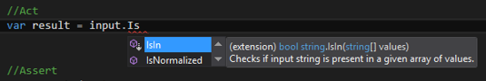
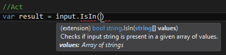

## Comment nommer une méthode ou une propriété qui renvoie un booléen

Une méthode ou une propriété qui renvoie un booléen est nommée en utilisant l'une des quatre options ci-dessous:

* le préfixe :
  * _Is_; 
  * _Has_; 
  * _Can_.
* Un verbe à la troisième personne du singulier comme :
  * _Exists_;
* Une séquence de mots qui représente une phrase en langage naturel dont on a supprimé les espaces entre les mots.
* _ToBooleanOrDefault\(\)_ dans le cas d'une méthode qui projette un objet vers un booléen.

Voici ci-après quelques exemples d'application.

#### Propriété automatique

```Csharp
public class Myclass
{
    ...
    public bool IsValid { get; set; }
    ...
}
```

#### Propriété avec membre privé associé

```Csharp
#region IsReadOnly

        private bool _isReadOnly = false;
        /// <summary>
        /// ...
        /// </summary>
        public bool IsReadOnly
        {
            get
            {
                return this._isReadOnly;
            }
            set
            {
                this._isReadOnly = value;
            }
        }

#endregion
```

#### Méthode d'instance développée sous la forme d'une méthode d'extension

```Csharp
public static class MyclassExtenions
{
    public static bool IsEqualTo(this Myclass input, Myclass value)
    {
        //code omitted for brevity
    }   
}

public class Myclass
{
  //code omitted for brevity
}
```

Plutôt que de développer les méthodes publiques d'instance sous la forme:

```Csharp
public class Myclass
{
  public bool IsEqualTo(Myclass value)
  {
      //code omitted for brevity
  }
}
```

Il est souvent plus intéressant de coder toutes les méthodes publiques d’instance en utilisant la technique des méthodes d'extension.

En effet, les méthodes d'extension permettent d'étendre le code d'une classe sans avoir accès au code source de cette classe. Il est donc possible d'enrichir n'importe quelle classe du Framework .Net avec ses propres méthodes. Par conséquent il est également possible d’enrichir ses propres classes sans avoir à modifier leur code source.

La méthode _ToBooleanOrDefault\(\)_ décrite ci-dessous permet par exemple d'étendre la classe System.String en lui ajoutant la méthode _ToBooleanOrDefault\(\)_, d'où le terme méthode d’extension. L'extension se fait en effet sous la forme d'une méthode et non d'une propriété.

L'avantage apporté par la méthode d’extension vient du fait que :

* il est parfaitement valide d'invoquer cette méthode sur un objet nul : le traitement du cas nul peut ainsi être complètement encapsulé à l'intérieur de la méthode d'extension;
* La classe qui est étendue contient principalement des propriétés qui décrivent l'état de l’objet; Ce type de classe peut ainsi être utilisée pour transférer un objet d'une couche à une autre de l'application \(de la couche business à la couche de présentation, ou bien de la couche data à la couche business\). Ce type d'objet est appelé un DTO object \(Data Transfer Object\);
* Les méthodes d'extension décrivent séparément toutes les actions qu'il est possible de réaliser sur un objet issu de cette classe;
* Une méthode d'extension est testable unitairement.

#### Projection développée sous la forme d'une méthode d'extension

```Csharp
public static class StringExtensions
{
    /// <summary>
    /// Try to convert input string into a boolean.
    /// </summary>
    /// <param name="input">String to be converted.</param>
    /// <returns>
    /// Returns true when input string has one of the value "1", "ok", "OK", "Ok", "True";
    /// Returns false for all other cases (like null, string.empty,"0", "Ko", etc ...).
    /// </returns>
    public static bool ToBooleanOrDefault(this string input)
    {
        //code omitted for brevity
    }
}
```

#### Séquence de mots qui représente une phrase

Pour déterminer le nom d’une méthode sous la forme d’une séquence de mots qui représente une phrase, commencez par créer un projet de test.

Ce projet de test va vous permettre d'utiliser en situation réelle le nom que vous allez choisir. Il va vous permettre de vérifier que le nom choisi est suffisamment intuitif et que le code induit est suffisamment expressif.

Le projet de test que vous avez crée contient une méthode de test par défaut :

```Csharp
using System;
using Microsoft.VisualStudio.TestTools.UnitTesting;

namespace UnitTestProject1
{
    [TestClass]
    public class UnitTest1
    {
        [TestMethod]
        public void TestMethod1()
        {
        }
    }
}
```

L'écriture du code dans une méthode de test se fait en trois phases nommées _Arrange_, _Act_, _Assert_.

Mettez en évidence ces trois phases de la façon suivante à l'intérieure de la méthode de test:

```Csharp
[TestMethod]
public void TestMethod1()
{
    //Arrange

    //Act

    //Assert
}
```

La phase _Arrange_ est la phase dans laquelle vous allez préparer tous les objets nécessaires pour exécuter votre future méthode. La phase _Arrange_ permet aussi de décrire une situation initiale à partir de laquelle sera executée la phase suivante. Pour cette raison la phase _Arrange_ est aussi appelée _Given_.

La phase _Act_ est la phase pendant laquelle vous allez exécuter votre méthode et en récupérer le résultat. la phase _Act_ est aussi appelée _When_.

La phase _Assert_ est la phase pendant laquelle vous allez comparer le résultat obtenu dans la phase _Act_ avec le résultat attendu; en cas de différence vous signalez l'échec du test.La phase _Assert_ est aussi appelée _Then_

En appliquant ces principes pour créer un test de la méthode d'extension _ToBooleanOrDefault\(\)_ décrite ci-dessus, vous devriez obtenir un code de test semblable au code ci-dessous:

```Csharp
[TestMethod]
public void TestMethod1()
{
    //Arrange
    var input = "1";

    //Act
    var result = input.ToBooleanOrDefault();

    //Assert
    var expected = true;
    if (result != expected)
    {
        Assert.Fail();
    }
}
```
Ou bien :
```Csharp
[TestMethod]
public void TestMethod1()
{
    //Given
    var input = "1";

    //When
    var result = input.ToBooleanOrDefault();

    //Then
    var expected = true;
    if (result != expected)
    {
        Assert.Fail();
    }
}
```

En utilisant la librairie [NFluent](http://n-fluent.net/), vous pouvez écrire la phase _Then_/_Assert_ en utilisant une syntaxe proche du langage naturel:

```Csharp
[Test]
public void TestMethod1()
{
    //Given
    var input = "1";

    //When
    var result = input.ToBooleanOrDefault();

    //Then
    var expected = true;
    Check.That(result).IsEqualTo(expected);
}
```

Pour créer le premier test unitaire de votre future méthode, il faut mettre en œuvre les étapes ci-dessous dans l'ordre indiqué:  
>1. Décrire brièvement ce que doit faire cette méthode sous la forme d'une seule phrase la plus synthétique possible; cette phrase doit être si possible en anglais;  
2. Transformer cette phrase en une ligne de code \(typiquement la ligne de code que vous seriez amené à écrire dans la partie _ACT_ du test unitaire\) en supprimant les mots inutiles et en concaténant les mots restants pour former un nom conforme à la convention Pascal Casing;  
3. Définir le nom obtenu sous la forme d'une méthode d'extension à l'extérieur du projet de test \(c'est à dire dans le projet de votre application\);  
4. Commenter la méthode sous la forme de [commentaires XML](https://msdn.microsoft.com/en-us/library/b2s063f7.aspx);  
5. Écrire les spécifications de cette nouvelle méthode sous la forme d'exemples en commençant par les cas les plus simples;  
6. Prendre le premier exemple de la spécification pour écrire la partie _Arrange_ du premier test unitaire;  
7. Mettre en place le code d'exécution de la nouvelle méthode dans la partie _Act_ de la méthode de test en vérifiant que:
 >   * l'IntelliSense ramène bien le commentaire XML;
 >   * Le commentaire affiché est cohérent avec le nom choisi;
 >   * L'IntelliSense permet de découvrir et de manipuler rapidement cette nouvelle méthode.
>8. Valider le résultat dans la partie _Assert_ de la méthode de test;
9. Vérifier que le test échoue;
10. Montrer l'intégralité de ce premier test unitaire aux autres membres de l' équipe pour vérifier qu'ils comprennent le code;
11. Vérifier que le nom choisi fait l'unanimité au sein de l'équipe.

Je vous propose d'appliquer ces 11 étapes pour développer une méthode qui consiste à déterminer si une chaîne de caractères est présente dans un tableau de chaînes de caractères.

#### Étape 1 : Décrire brièvement ce que doit faire la méthode

Vous pouvez construire cette phrase en la structurant de la manière suivante:

> L'objectif est de ... \(verbe à l'infinitif\) ... \(sur ce quoi porte l'action définie par le verbe précédent\) est dans une situation donnée \(description de la situation\) ou possède un attribut spécifique \(description de l'attribut\);

Dans le cas d'une projection d'un objet vers un booléen, la phrase est structurée de la manière suivante:

> L'objectif est de `...` \(verbe à l'infinitif\) `...` \(sur ce quoi porte l'action définie par le verbe précédent\) en `...` \(résultat de la projection\) ou bien de récupérer `...` \(valeur par défaut\) en cas d'impossibilité.

Par exemple:

* L'objectif est de `déterminer` `que le mot saisi par l'utilisateur est présent dans un tableau de valeurs prédéfinies`.

Autre exemple:

* L'objectif est de `convertir` `le texte présent dans une cellule d'un tableau` en un `booléen` ou bien de récupérer la valeur `false` en cas d'échec de la conversion. 

Écrivez ensuite la phrase en anglais. Les deux exemples ci-dessus pourraient ainsi être traduits de la manière suivante:

* Check if input string is present in a given array of values.

* Convert input string into a boolean or get false value when conversion fails.

#### Étape 2 : Transformer cette description en une ligne de code

Cette transformation peut se faire en plusieurs étapes.

Partez d'abord de l'étape précédente comme par exemple:

> Check if input string is present in a given array of values.

Supprimez ensuite les espaces inutiles, concaténez les mots entre eux en respectant la convention PasCal Casing pour le nom de la méthode et la convention Camel Casing pour le nom des paramètres, séparez le sujet et le verbe par un point:

> Check if inputString.IsPresentIn\( givenArrayOfValues \)

Supprimez tous les mots qui vous semblent inutiles pour obtenir une écriture la plus ramassée possible:

> Check if input.IsIn\(values\)

Vérifiez qu'en remplaçant le début de la phrase par _var result =_, vous pouvez former une ligne de code valide pour la partie _ACT_ de votre premier test unitaire:

```Csharp
//ACT
var result = input.IsIn(values);
```

Vérifiez ensuite qu'en situation réelle d'usage de la méthode, vous êtes capable de reformuler à l'identique la description de départ:

```Csharp
if (input.IsIn(values) )
{
    //Ce code est exécuté si le texte saisi par l'utilisateur est présent dans une liste de valeurs prédéfinies.
}
```

Vous allez certainement constater un écart entre la description de départ et la description reconstruite d'après la simple lecture du code.

Dans l'exemple ci-dessus la phrase reconstruite laisse penser que le paramètre _values_ représente une liste de valeurs \(`List<string>`\) et non pas un tableau de valeurs \(`string[]`\).

Constater un écart signifie que l'usage de cette future méthode va poser un problème tôt ou tard soit pour vous même soit pour les autres développeurs de votre équipe, soit pour les personnes qui seront en charge de la maintenance future de l'application.

Même si cet écart vous paraît insignifiant ou négligeable, il est nécessaire de le réduire au maximum, car il introduit un risque majeur en terme de coûts quand il s'agira de faire évoluer l'application conformément aux attentes du marché ou du métier.

Pour réduire cet écart, demandez aux membres de l'équipe d'écrire ce qu'ils comprennent de votre code :

```Csharp
if (input.IsIn(values) )
{
    //Ce code est exécuté si <merci de compléter>
}
```

De cette demande d'avis va naître un échange qui vous permettra de trouver le nom de la méthode et en définir un usage qui fera l'unanimité.

#### Étape 3 : Définir le nom obtenu sous la forme d'une méthode d'extension

Pour créer une méthode d'extension, vous pouvez ajouter le code suivant soit dans le même fichier de classe soit dans un projet séparé si vous souhaitez réutiliser celle-ci dans différents projets:

```Csharp
public static class StringExtensions
{
    public static bool IsIn(this string input, string[] values)
    {
        //code omitted for brevity
    }
}
```

Notez que le nom du premier paramètre est nommé _input_, et que le nom du deuxième paramètre est _values_ quand celui-ci désigne un ensemble d'objets, c'est à dire soit une liste `List<T>` soit un tableau `T[]` d'objet du même type, soit un nombre indéterminé d'ensembles d'objets `params Object[]`.

Ainsi la méthode d'extension ci-dessus pourrait aussi supporter les signatures suivantes:

```Csharp
public static class StringExtensions
{
    public static bool IsIn(this string input, IList<string> values)
    {
        //code omitted for brevity
    }
}
```

```Csharp
public static class StringExtensions
{
    public static bool IsIn(this string input, params Object[] values)
    {
        //code omitted for brevity
    }
}
```

Dans la méthode d'extension ci-dessus, le mot clé _params_ permet de passer un nombre quelconque de listes ou de tableaux.

De manière générale je vous recommande de respecter la convention de nommage ci-dessous pour définir la signature d'une méthode d'extension:

> Le nom donné au premier paramètre d'une méthode d'extension est `input`
>
> > Si cette méthode d'extension nécessite d'accéder à un ensemble d'objets du même type:
> >
> > > le nom de ce paramètre est `values`
> >
> > Si cette méthode d'extension nécessite d'accéder à un ensemble d'objets de type différents, vous devez créer une classe qui regroupe tous ces objets sous la forme de propriétés, puis passer tous ces objets sous la forme d'une instance de cette classe:
> >
> > > le nom de ce paramètre est alors `context` quand les objets correspondants définissent un contexte d’exécution, ou bien `args` quand au moins un des objets est utilisé pour transférer une information entre l'appelant et l'appelé,
>
> et le nom de la méthode d'extension est postfixé par l'un des termes suivants:
>
> > In
> >
> > From
> >
> > Of
> >
> > With

#### Étape 4 : Commenter la méthode sous la forme de [commentaires XML](https://msdn.microsoft.com/en-us/library/b2s063f7.aspx)

Une fois que vous avez défini la signature de la méthode d'extension comme dans l'exemple ci-dessous:

```Csharp
public static class StringExtensions
{
    public static bool IsIn(this string input, string[] values)
    {
        //code omitted for brevity
    }
}
```

Insérez trois fois le caractère / au dessus de la déclaration de la méthode.

Ce raccourci permet de générer automatiquement les commentaires dits XML de la méthode d'extension:

```Csharp
public static class StringExtensions
{
    /// <summary>
    /// 
    /// </summary>
    /// <param name="input"></param>
    /// <param name="values"></param>
    /// <returns></returns>
    public static bool IsIn(this string input, string[] values)
    {
        //code omitted for brevity
    }
}
```

Dans la balise `<summary> ...</summary` insérez la description de la méthode que vous avez réalisée à la fin de l'étape 1:

```Csharp
public static class StringExtensions
{
    /// <summary>
    /// Checks if input string is present in a given array of values.
    /// </summary>
    /// <param name="input"></param>
    /// <param name="values"></param>
    /// <returns></returns>
    public static bool IsIn(this string input, string[] values)
    {
        //code omitted for brevity
    }
}
```

Renseignez le plus précisément possible la ou les balises `<param> ...</param>`:

```Csharp
public static class StringExtensions
{
    /// <summary>
    /// Checks if input string is present in a given array of values.
    /// </summary>
    /// <param name="input">Input string.</param>
    /// <param name="values">Array of strings</param>
    /// <returns></returns>
    public static bool IsIn(this string input, string[] values)
    {
        //code omitted for brevity
    }
}
```

Renseignez ensuite la balise `<returns>...</returns>` en vous aidant de ce que vous avez produit à l'étape 2:

```Csharp
if (input.IsIn(values) )
{
    //Ce code est exécuté si <merci de compléter>
}
```

Cela pourrait donner par exemple:

```Csharp
public static class StringExtensions
{
    /// <summary>
    /// Checks if input string is present in a given array of values.
    /// </summary>
    /// <param name="input">Input string.</param>
    /// <param name="values">Array of strings</param>
    /// <returns>Returns true if input string is present in the predefined array of values.</returns>
    public static bool IsIn(this string input, string[] values)
    {
        //code omitted for brevity
    }
}
```

En résumé, tout le contenu des commentaires XML provient directement du travail effectué à l'étape 1 \(Décrire brièvement ce que doit faire la méthode\) et à l'étape 2 \(Transformer cette description en une ligne de code\) décrites ci-dessus.

Notez que la balise `<returns>...</returns>` décrit uniquement le cas où la méthode renvoie vrai.

Le contenu de la balise `<returns>...</returns>` doit suivre la règle suivante:

> Dans un commentaire XML, la balise `<returns>...</returns>` commence toujours par `Returns true if ...`

Autrement dit la balise `<returns>...</returns>` doit toujours décrire le cas positif. Si vous décrivez directement le cas négatif car cela vous semble plus direct ou plus naturel, cela signifie que le nom choisi nécessite de penser négativement ce qu'il faut à tout prix éviter: je vous expliquerai pourquoi dans le chapitre suivant.

#### Étape 5 : Écrire les spécifications

Cette étape est à mes yeux l'étape pivot, celle qui va permettre de dérouler naturellement les tests unitaires dans une approche TDD \(Test Driven Development \) s'il s'agit d'une action technique ou les tests fonctionnels dans une approche BDD \(Behavior Driven Development \) s'il s'agit d'une action métier.

Ecrivez les spécifications sous forme d'exemples.

Commencez d'abord par décrire les exemples les plus simples.

Un exemple simple est un exemple qui permet un traitement immédiat nécessitant très peu de lignes de code pour être implémenté.  
Vous constaterez que les exemples les plus simples sont souvent les moins probables.

Ecrivez ensuite des exemples de plus en plus complexe.

Finissez ensuite avec des exemples qui décrivent des exigences en terme de performance, c'est à dire en terme de vistesse d'exécution, en terme d'allocation mémoire ou en terme de pourcentage d'occupation de la CPU. J'appelle ces exigences des spécifications orientées performance.

> En résumé, l'écriture des spécifications se fait en trois étapes:
>
> * Commencer par les exemples les plus simples;
> * Continuer avec des exemples de moins en moins simples;
> * Finissez avec des exemples orientés performance.

Voici comment pourraient êtres écrites les spécifications de la méthode d'extension `IsIn()`:

###### Exemples simples

> Quand le tableau de valeurs est null, la méthode renvoie toujours faux.
>
> Quand le tableau de valeurs est vide, la méthode renvoie toujours faux.
>
> Quand la chaîne de caractères en entrée est nulle et que le tableau de valeurs contient un élement null, la méthode renvoie vrai.
>
> Quand la chaîne de caractères en entrée est vide et que le tableau de valeurs contient un élement vide, la méthode renvoie vrai.
>
> Quand la chaîne de caractères en entrée est présente à l'identique dans le tableau, la méthode renvoie vrai.

###### Exemples moins simples

> Quand la chaîne de caractères est présente dans le tableau non pas à l'identique mais avec une différence uniquement sur la casse, la méthode renvoi vrai.
>
> Quand la chaîne de caractères est présente dans le tableau non pas à l'identique mais avec des espaces en plus après la chaîne, la méthode renvoi vrai.

###### Exemples orientés performance

> Quand la chaîne de caractères n'est pas présente dans un tableau de valeurs contenant 100 élements, le temps d'éxécution de la méthode ne doit pas dépasser 0,5 millisecondes.

#### Étape 6 : Prendre le premier exemple de la spécification pour écrire la partie _Arrange_ du premier test unitaire

Revenez sur votre projet de test.  
Mettez en place le premier test unitaire sous la forme:

```Csharp
[TestMethod]
public void TestMethod1()
{
    //Arrange

    //Act

    //Assert
}
```

Partez du premier exemple de la spécification:

> Quand le tableau de valeurs est null, la méthode renvoie toujours faux.

Eventuellement traduisez en anglais l'exemple:

> Should return false when the array of values is null

Pour donnez un nom suffisament évocateur à la méthode de test \(et oui, même les méthodes de test doivent avoir un nom suffisament évocateur et donc nommer correctement une méthode de test est aussi important que nommer correctement la méthode ou la propriété qui est visée par la méthode de test\), il suffit de concaténer tous les mots de la phrase:

```Csharp
[TestMethod]
public void QuandLeTableauDeValeursEstNullLaMéthodeRenvoieToujoursFaux()
{
    //Arrange

    //Act

    //Assert
}
```

ou bien en anglais:

```Csharp
[TestMethod]
public void ShouldReturnFalseWhenTheArrayOfValuesIsNull()
{
    //Arrange

    //Act

    //Assert
}
```

Il reste à définir dans un premier temps la partie _Arrange_ du test:

```Csharp
[TestMethod]
public void ShouldReturnFalseWhenTheArrayOfValuesIsNull()
{
    //Arrange
    string input = "test";
    string[] values = null;

    //Act

    //Assert
}
```

Dans la partie _Arrange_ vous préparez tous les objets nécessaires pour exécuter la méthode.  
Pour la méthode d'extension `IsIn()`, il suffit de définir la chaîne de caractères en entrée ainsi que le tableau de valeurs.

L'exemple ci-dessus est un exemple simple. Dans le cas d'un test unitaire fonctionnel, la partie _Arrange_ peut contenir tout type de code permettant de créer des objets métiers dans un état spécifique. Cependant le nombre de lignes de code dans la partie _Arrange_ ne doit jamais excéder cinq lignes.

#### Étape 7 : Mettre en place le code d'exécution de la nouvelle méthode dans la partie _Act_ de la méthode de test

La phase _Act_ est la phase pendant laquelle vous allez exécuter votre méthode et en récupérer le résultat:

```Csharp
[TestMethod]
public void ShouldReturnFalseWhenTheArrayOfValuesIsNull()
{
    //Arrange
    string input = "test";
    string[] values = null;

    //Act
    var result = input.IsIn(values);

    //Assert
}
```

Cette phase est l'une des plus importantes car vous allez vérifier que :

* l'IntelliSense ramène bien le commentaire XML;
* Le commentaire affiché est cohérent avec le nom choisi;
* L'IntelliSense permet de découvrir et de manipuler rapidement cette nouvelle méthode.

Vous devriez obtenir quelque chose de similaire aux copies d'écran ci-dessous:  




#### Étape 8 : Valider le résultat dans la partie _Assert_ de la méthode de test

La phase _Assert_ est la phase pendant laquelle vous allez comparer le résultat obtenu dans la phase _Act_ avec le résultat attendu; en cas de différence vous signalez l'échec du test:

```Csharp
[TestMethod]
public void ShouldReturnFalseWhenTheArrayOfValuesIsNull()
{
    //Arrange
    string input = "test";
    string[] values = null;

    //Act
    var result = input.IsIn(values);

    //Assert
    var expected = true;
    if (result != expected)
    {
        Assert.Fail();
    }
}
```

L'objet `Assert` expose bien d'autres méthodes que la méthode `Fail()` utilisée ci-dessus, comme par exemple:

```Csharp
Assert.AreSame(result, expected);
Assert.Equals(result, expected);
Assert.IsFalse(result);
```

N'employez aucune de ces méthodes car elles peuvent introduire ce qu'on appelle un false positive, c'est à dire que le teste unitaire passe au vert alors qu'il devrait rester au rouge.

Définissez explicitement le résultat attendu:

```Csharp
var expected = true;
```

Signalez l'échec du test sous la forme la plus basique qui soit:

```Csharp
Assert.Fail();
```

Signalez l'échec du test uniquement quand le résultat est différent de ce qui est attendu en testant le plus simplement et le plus directement la non égalité des deux objets:

```Csharp
if (result != expected)
{
    Assert.Fail();
}
```

#### Étape 9 : Vérifier que le test échoue

Une fois que vous avez mis en place les trois phases du test, vous pouvez exécuter le test. Dans une approche TDD cette première exécution doit aller à l'échec.

Pour faire échouer la première exécution du test, la première et unique ligne de code de la méthode à tester doit être:

```Csharp
throw new NotImplementedException();
```

Avant la première exécution du test assurez vous donc que la méthode sous test est codée de la manière suivante:

```Csharp
public static bool IsIn(this string input, string[] values)
{
    throw new NotImplementedException();
}
```

#### Étape 10 : Montrer l'intégralité de ce premier test unitaire aux autres membres de l'équipe pour vérifier qu'ils comprennent le code

A compléter

#### Étape 11 : Vérifier que le nom choisi fait l'unanimité au sein de l'équipe

A compléter

