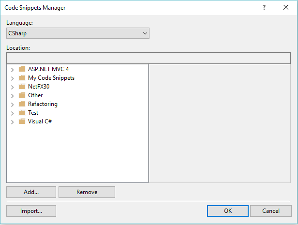
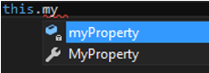
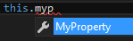
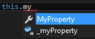
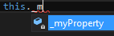
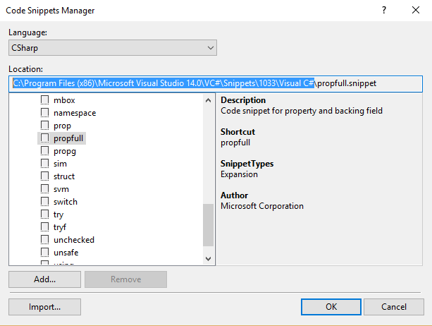
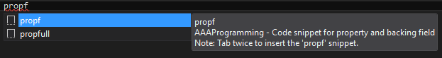

### Cas particulier des variables qui sont associées à une propriété

Les membres privés d'une classe sont par définition des variables locales à la classe où ils sont définis.

Le nom d'un membre privé doit par conséquent être conforme à la convention de nom Camel Casing.

Quand vous insérez une propriété dans une classe en utilisant le code snippet nommé *propfull*, vous obtenez le résultat suivant:

```Csharp
private int myVar;
public int MyProperty
{
    get { return myVar; }
    set { myVar = value; }
}
```

Un code snippet est un mot clé qui permet d’insérer un bloc de code prédéfini. 
Pour mettre en action un code snippet, il suffit de cliquer à l'endroit où on souhaite ajouter le bloc de code prédéfini, de taper ensuite le mot clé associé au code snippet, comme par exemple *propfull*, puis de cliquer deux fois sur la touche TAB.

L'objectif du code snippet est de favoriser l'insertion rapide de code. Il s'agit donc d'un outil de productivité.
Il existe plein de code snippets disponibles pour le language CSharp. Pour découvrir les codes snippets disponibles dans Visual Studio, allez dans le menu *Tools* de Visual Studio puis sélectionnez l'option *Code Snippets Manager...* :



Naviguez dans les dossiers proposés et découvrez les code snippets fournis par Microsoft.

La propriété fournie par le code snippet *propfull* déclare une variable locale à la classe et une propriété dont le getter et le setter s’appuient sur cette variable locale.

Le nom de la variable locale, *myVar*, est conforme à la convention de nom Camel Casing.
Le nom de la propriété, *MyProperty*, est conforme à la convention de nom Pascal Casing.

Le nom myVar pose cependant un problème. En effet le nom myVar est très éloigné sémantiquement du nom MyProperty laissant ainsi penser que l'un peut être modifié indépendamment de l'autre. 
Un autre développeur, qui serait amené à modifier ou à faire évoluer votre code, pourrait parfaitement modifier la variable myVar au lieu de la propriété MyProperty (et vice versa) entraînant ainsi un comportement erroné de l'objet modifié. Cela peut avoir pour conséquence un dysfonctionnement de l'interface graphique de l'application notamment quand les objets doivent être observables comme par exemple dans une application WPF.

Pour résoudre ce problème une première approche consiste à réécrire la propriété ci-dessus de la façon suivante:

```Csharp
private int myProperty;
public int MyProperty
{
    get { return myProperty; }
    set { myProperty = value; }
}
```

Le nom de la variable et le nom de la propriété sont identiques d'un point de vues sémantique puisqu'ils ne diffèrent que la par la casse de la première lettre.

Cependant cela accroît le risque d'utiliser dans d'autre partie du code la variable au lieu de la propriété (et vice versa). En effet l'IntelliSense propose maintenant les choix suivants quand vous commencez à taper le nom de la propriété:


L'intelliSense étant un outil de productivité, il est vraisemblable que vous choisissiez, sans même vous en apercevoir, la variable locale en lieu et place de la propriété.
C'est ce que j'appelle le bug de productivité : vous introduisez un bug dans votre application parce que vous avez choisi trop rapidement l'option proposée par l'IntelliSense.

Comment résoudre ce problème posé par l'usage intensif de l'IntelliSense?

Il suffit de réécrire la propriété ci-dessus de la façon suivante:

```Csharp
private int _myProperty;
public int MyProperty
{
    get { return _myProperty; }
    set { _myProperty = value; }
}
```
En ajoutant simplement le caractère _ devant le nom de la variable locale, l'IntelliSense apporte les avantages suivants:
* Quand vous commencez à taper les trois premières lettres de la propriété, l'IntelliSense masque l'accès à la variable locale:
  

* Quand vous commencer à taper seulement les deux premières lettres de la propriété, l'IntelliSense vous positionne par défaut sur la propriété et non sur la variable locale:


* Quand vous commencez à taper le caractère _, l'Intellisense vous donne accès uniquement aux variables locales qui sont associées à des propriétés:

  
  
    
    
 Pour être certain que l'IntelliSense fasse correctement son travail et vous évite de sélectionner la variable au lieu de la propriété, celle ci peut être réécrite de la façon suivante:
 
```Csharp
private int _myProperty;
public int MyProperty
{
    get
    {
        return this._myProperty;
    }
    set
    {
        this._myProperty = value;
    }
}
```

Pour vous aider à insérer automatiquement une nouvelle propriété en suivant la syntaxe proposée ci-dessus, vous pouvez substituer le code snippet propfull par votre propre version.

Pour cela, ouvrez la fenêtre "Code Snippets Manager", ouvrez le dossier Visual CSharp puis cliquez sur *propfull*. Le champs *Location* vous montre l'emplacement du fichier associé au code snippet *propfull*:



Allez dans le dossier indiqué:
```Csharp
C:\Program Files (x86)\Microsoft Visual Studio 14.0\VC#\Snippets\1033\Visual C#
```

et copiez le fichier propfull.snippet dans le dossier :
```Csharp
Documents\Visual Studio 2015\Code Snippets\Visual C#\My Code Snippets.
```

Ouvrez le fichier ainsi copié dans Visual Studio et remplacez son contenu par:

```Xml
<?xml version="1.0" encoding="utf-8" ?>
<CodeSnippets  xmlns="http://schemas.microsoft.com/VisualStudio/2005/CodeSnippet">
	<CodeSnippet Format="1.0.0">
		<Header>
			<Title>propf</Title>
			<Shortcut>propf</Shortcut>
			<Description>AAAProgramming - Code snippet for property and backing field</Description>
			<Author>My Company</Author>
			<SnippetTypes>
				<SnippetType>Expansion</SnippetType>
			</SnippetTypes>
		</Header>
		<Snippet>
			<Declarations>
				<Literal>
					<ID>type</ID>
					<ToolTip>Property type</ToolTip>
					<Default>int</Default>
				</Literal>
				<Literal>
					<ID>property</ID>
					<ToolTip>Property name</ToolTip>
					<Default>MyProperty</Default>
				</Literal>
				<Literal>
					<ID>field</ID>
					<ToolTip>The variable backing this property</ToolTip>
					<Default>_myProperty</Default>
				</Literal>
			</Declarations>
			<Code Language="csharp"><![CDATA[
      private $type$ $field$;
	public $type$ $property$
	{
		get 
    { 
      return this.$field$;
    }
		set 
    { 
      this.$field$ = value;
    }
	}
	$end$]]>
			</Code>
		</Snippet>
	</CodeSnippet>
</CodeSnippets>
```

Enregistrez le fichier propfull.
Retournez dans le code source de votre classe et tapez *propf*:



Si vous appuyez immédiatement deux fois sur la touche Tab, vous insérer dynamiquement la propriété:


```Csharp
private int _myProperty;
public int MyProperty
{
    get
    {
        return this._myProperty;
    }
    set
    {
        this._myProperty = value;
    }
}
```

En modifiant la section Code du code snippet propf de la façon suivante:

```Xml
<Code Language="csharp"><![CDATA[
      #region $property$
      
  private $type$ $field$;
  /// <summary>
  /// 
  /// </summary>
	public $type$ $property$
	{
		get 
    { 
      return this.$field$;
    }
		set 
    { 
      this.$field$ = value;
    }
	}
  
  #endregion
	$end$]]>
			</Code>
```

Vous obtiendrez le résultat suivant chaque fois que vous utiliserez le code snippet propf:

```CSharp
#region MyProperty

private int _myProperty;
/// <summary>
/// 
/// </summary>
public int MyProperty
{
    get
    {
        return this._myProperty;
    }
    set
    {
        this._myProperty = value;
    }
}

#endregion
```

En résumé, une variable locale qui est associée à une propriété doit répondre aux règles suivantes:

>Le nom d'une variable locale associée à une propriété est constitué d'un préfixe, le caractère _, suivi d'un nom conforme à la convention Camel Casing.

> La variable doit être déclarée au plus près de la définition de la propriété.
> 
> La variable doit être utilisée exclusivement au sein du getter ou du setter de la propriété. 
> >Cette règle est fondamentale: l'état d'un objet doit être consulté ou modifié exclusivement au travers de la propriété associée, y compris dans le code que vous écrivez au sein de la classe où est définie cette propriété. J'aime appeler cette règle : protect yourself from yourself.
  > >Déroger à cette règle, c'est prendre le risque de modifier un objet métier d'une façon non attendue, ou pire, de provoquer une modification erronée des données métiers au moment de leur persistence par la couche d'accès aux données. 


