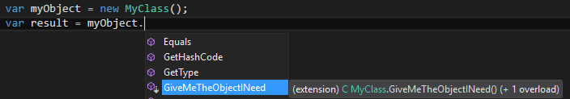

# Comment appliquer la loi de Déméter

Ce que dit la loi de Déméter est simple : soyez toujours courtois avec vos interlocuteurs. Si vous avez besoin d'une information ou d'une action qui ne peut être fournie que par une connaissance directe ou indirecte de votre interlocuteur, demandez à ce dernier de jouer les intermédiaires; ne court-circuitez jamais votre interlocuteur en communiquant directement avec ses relations.

Autrement dit, la loi de Déméter consiste à ne parler qu'avec ses voisins directs.

Chaque fois que vous écrivez du code qui consiste à chaîner des appels sur des objets différents via leurs propriétés ou leur méthodes en formant une séquence similaire à l'exemple ci-dessous:

```Csharp
var myObject = new MyClass();
var result = myObject.PropertyA.PropertyB.GiveMeTheObjectINeed(); 
```
cherchez à appliquer la loi de Déméter.

En choisissant de ne pas appliquer la loi de Déméter, vous diminuez la maintenabilité de votre application car toute modification d'un objet intermédiaire aura un impact sur votre code. De plus vous introduisez un couplage entre votre application et les classes sous-jacentes appelées au travers du chaînage des appels. Il est fort probable que ce couplage n'est jamais été prévu au départ de la conception de ces classes.

Pour appliquer la loi de Déméter, vous devez "remonter" le dernier appel directement sur le premier objet utilisé dans la chaîne des appels.
Ainsi l’exemple de code ci-dessus doit être écrit de la manière suivante:

```Csharp
var myObject = new MyClass();
var result = myObject.GiveMeTheObjectINeed(); 
```

Bien évidemment cette méthode ou cette propriété n'est pas disponible car sinon vous l'auriez utilisée.
En utilisant le principe des méthodes d'extension, vous pouvez créer cette méthode qui vous manque de la façon suivante:

```Csharp
public static class MyClassExtensions
{
    public static C GiveMeTheObjectINeed(this MyClass input)
    {
        if (input == null)
        {
            return null;
        }

        var firstObject = input.PropertyA;
        if (firstObject == null)
        {
            return null;
        }

        var secondObject = firstObject.PropertyB;
        if (secondObject == null)
        {
            return null;
        }

        var result = secondObject.GiveMeTheObjectINeed();
        return result;
    }
} 
```

L'intelliSense vous indique désormais que la méthode dont vous avez besoin est maintenant disponible directement sur votre "voisin":



La méthode d'extension mise en place permet de gérer les états possibles des objets intermédiaires et notamment le cas où ils sont nuls. Vous avez ainsi augmenté la maintenabilité de l'application.

Le code mis en place dans la méthode d'extension permet aussi de mettre en évidence si les objets intermédiaires sont susceptibles d'ouvrir des ressources sur le système d'exploitation. En effet si vous détectez la présence d'une méthode ```Dispose()``` ou ```Close()``` sur ces objets, vous devez impérativement appeler l'une ou l'autre avant de sortir de la méthode.

