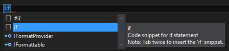

# Comment coder une expression booléenne

  
 Votre code doit raconter une histoire; par conséquent toute expression booléenne telle que :
 
 ```Csharp
if ( A )
{
  //code omitted for brevity
}
```
 
 doit être écrite sous la forme d'une phrase positive.
 
 Par défaut, et dans la mesure du possible, vous devez toujours formuler de manière positive l'expression booléenne que vous êtes sur le point de coder. 
 
 Pour réaliser cela, substituer l'expression ```A``` par  une méthode d'extension définie sur le type d'objet qui vous semble le plus approprié.
  
 Cette méthode d'extension doit être nommée en utilisant l'une des trois options ci-dessous:
* avoir le préfixe :
  * *Is*; 
  * *Has*; 
  * *Can*.
* Être Un verbe à la troisième personne du singulier comme :
  * *Exists*;
* Etre Une séquence de mots qui représente une phrase en langage naturel dont on a supprimé les espaces entre les mots.
 
Pour mettre en œuvre la méthodologie de création de nom d'une méthode ou d'une propriété qui renvoie un booléen reportez vous à la section correspondante : [Comment nommer une méthode ou une propriété qui renvoie un booléen](NameThingsCorrectly/HowToCreateNameForBooleanMethodOrPrperty.md).
 

Le code snippet ci-dessus peut donc être réécrit de la manière suivante:

```Csharp
var myObject = ... //code omitted for brevity
if ( myObject.IsXXX() )
{
  //code omitted for brevity
}
```

ou bien

```Csharp
var myObject = ... //code omitted for brevity
if ( myObject.HasXXX() )
{
  //code omitted for brevity
}
```

ou bien

```Csharp
var myObject = ... //code omitted for brevity
if ( myObject.CanXXX() )
{
  //code omitted for brevity
}
```

Notez qu'il faut toujours commencer par coder l'usage de la méthode d'extension avant même de coder son implémentation. Si vous utilisez la méthodologie TDD vous trouverez cette approche normale, dans le cas contraire cette approche devrait vous inciter à mettre en œuvre cette méthodologie.

Une fois que vous avez défini le nom et l'usage de la méthode d'extension, il reste à l'implémenter.

La première ligne de code de cette méthode d'extension doit être :

```Csharp
throw new NotImplementedException();
```
Ceci est la garantie que la première exécution du premier test unitaire associée à cette méthode va à l'échec.

Si vous êtes dans une approche TDD et si vous avez défini les spécifications associées à cette méthode d'extension et bien commencez par mettre en place le code qui fait passer la première spécification.

Pour savoir commencer définir les spécifications d'une méthode booléenne, reportez vous à la section correspondante : [Comment nommer une méthode ou une propriété qui renvoie un booléen](NameThingsCorrectly/HowToCreateNameForBooleanMethodOrPrperty.md).

Si vous n'avez pas défini de spécifications et que vous souhaitez déjà coder l'expression booléenne sous la forme d'une méthode d'extension, appuyez vous sur les règles suivantes pour structurer le contenu de votre code:

>Quand vous développez une méthode, vous devez en sortir le plus vite possible. Autrement dit si vous pouvez déterminer un cas de figure qui permet de faire immédiatement un ```return``` écrivez d'abord ce cas.

>La dernière instruction d'une méthode booléenne est toujours: ```return false;```

>le bloc de code qui précède la dernière ligne de code d'une méthode booléenne est toujours de la forme:
 ```Csharp
if ( A )
{
  //code omitted for brevity
  return true;
}
```
L'expression ```A``` ci-dessus peut être exprimée en pensée positive ou en pensée négative.

Une méthode booléenne doit donc toujours être structurée de la manière suivante:

```Csharp
public static bool IsIn(this string input, string[] values)
{
    //code omitted for brevity
    if ( A )
    {
      //code omitted for brevity
      return true;
    }
    return false;
}
```

ou bien
```Csharp
public static bool IsIn(this string input, string[] values)
{
    //code omitted for brevity
    if ( ! A )
    {
      //code omitted for brevity
      return true;
    }
    return false;
}
```

Vous verrez dans la section suivante comment coder une expression négative sans utiliser l'opérateur de négation ```!```.


>Quand vous codez un ```if``` procédez de la manière suivante:
Tapez le mot clé ```if``` puis attendez que l'IntelliSense vous montre l'existence du code snippet associé:


>Appuyez ensuite deux fois sur la touche ```TAB```. Visual Studio substitue le mot clé ```if``` par le code:

```Csharp
if (true)
{

}
```


Notez que Visual Studio vous incite par défaut à penser et à coder positif.

Il ne vous reste plus qu'à remplacer ```true``` par une expression booléenne codée en utilisant la technique décrite dans cette section.

Si la méthode que vous développez contient une boucle ```for``` ou ```foreach```, vous pouvez structurer votre boucle en vous appuyant sur la règle suivante:

>Quand vous développez une boucle ```for``` ou ```foreach```, vous devez en sortir le plus vite possible. Autrement dit si vous pouvez déterminer un cas de figure qui permet de passer immédiatement à l'itération suivante ,écrivez d'abord ce cas.
>
>Si vous pouvez déterminer un cas de figure qui permet de sortir de la boucle, écrivez d'abord ce cas.

Autrement dit, une boucle ```for``` ou ```foreach``` doit toujours être codée de la manière suivante:

```Csharp
foreach (var item in input)
{
    if (A)
    {
        //code omitted for brevity
        continue;
    }
    if (B)
    {
        //code omitted for brevity
        return result;
    }
    //code omitted for brevity
} 
```


A compléter