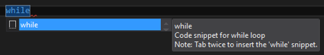

# Comment coder une boucle While

  
Pour coder une boucle ```while``` , vous pouvez vous appuez sur le code snippet du même nom.

Tapez le mot clé ```while``` puis attendez que l'IntelliSense vous montre l'existence du code snippet associé:



Appuyez ensuite deux fois sur la touche ```TAB```. Visual Studio substitue le mot clé ```while``` par le code:

```Csharp
while (true)
{

}
```

Notez que Visual Studio vous incite par défaut à penser et à coder positif une boucle ```while```.

L'astuce consiste ici à ne jamais modifier l'expression booléenne en entrée de la boucle ```while```, c'est à dire qu'une boucle ```while``` une fois codée doit toujours être de la forme:

```Csharp
while (true)
{
  //code omitted for brevity
}
```

Cette approche vous mets dans la position de faire la preuve que votre code permettra de sortir de la boucle à l'exécution.

La mise en œuvre d'une boucle ```while``` entraîne un risque non négligeable d'une boucle infinie, la conséquence d'une boucle infinie étant dans le meilleure des cas un stack overflow et dans le pire des cas un redémarrage de la machine.

Il est donc vital d’apporter la preuve qu'à l’exécution le code sortira toujours de la boucle.

Une boucle while doit être codée en s'inspirant du modèle ci-dessous:

```Csharp
int loopCounter = 0;
int loopCounterMaxValue = 1000;
while (true)
{
    loopCounter += 1;
    if (loopCounter > loopCounterMaxValue)
    {
        //TODO : log
        break;
    }

    if (A)
    {
        break;
    }

    //code ommited for brevity

}
```

Dans l'exemple ci-dessus ```A``` représente l'expression qui détermine la sortie de la boucle, ```loopCounterMaxValue``` a une valeur arbitraire que vous devrez adapter à votre cas.

